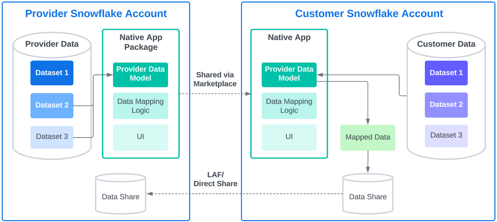

# Data Model Mapper
The Data Model Mapper native app helps providers get conformed data from partners at scale, from any cloud/region.  It provides a Streamlit UI that enables business users to model, map, and share their data to a provider's data specification, all without SQL and without needing to be a data engineer.

## Support Notice
All sample code is provided for reference purposes only. Please note that this code is provided “AS IS” and without warranty.  Snowflake will not offer any support for use of the sample code.

Copyright (c) 2024 Snowflake Inc. All Rights Reserved.

Please see TAGGING.md for details on object comments.

## Overview
In the provided notebook, we have constructed a single-account, end-to-end example using a supply chain use case.  Imagine a product distributor needing to manage inventory at a number of stores.  If every store has their own data model, that can present a significant data engineering challenge to create and manage all of the pipelines.  With the Data Model Mapper solves this by helping each store's business users model, map, and share their data with the provider, with the data matching the provider's specification.  

The consumer gets an easy tool to help get their data shared, and the provider gets data in the same format from all of their consumers.

1. The Provider defines Target Collections/Entities/Attributes (logical sets, tables, and columns) to act as definitions for the consumer to use to model/map their data.
2. The Provider lists the app and shares with consumers
3. The Consumer uses the app's Streamlit UI to model and map their data to the provider's target specification, all without SQL
4. The Consumer shares the data back to the provider in the prescribed shape
5. The Provider adds the share and incorporates into their pipelines

## Deployment Directions
1. Import the data_model_mapper.ipynb notebook into your Snowflake environment
2. Hit Run All
3. Open the DATA_MODEL_MAPPER_APP from the Apps window in Snowsight and follow directions

## Reference Architecture
